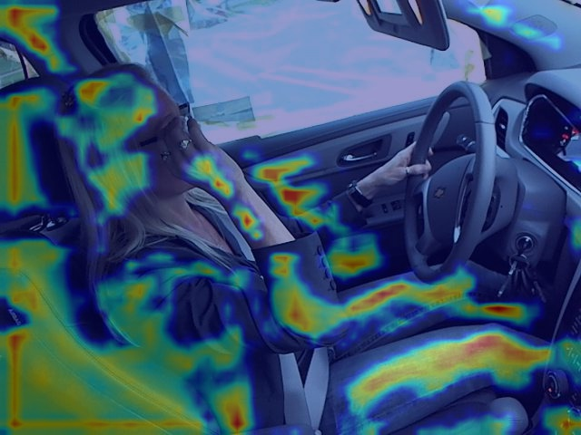
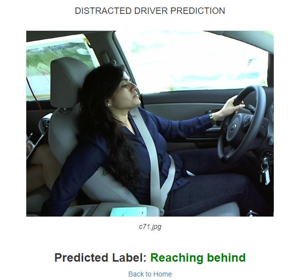

 <h1 span style="color:red;">State-Farm-Distracted-Driver-Detection</h1>

<i> Kaggle hosted the challenge few years ago which focused on identifying distracted drivers using Computer Vision  
    Details of challenge can be found here - https://www.kaggle.com/c/state-farm-distracted-driver-detection </i>

    

    
<h3> Problem Description </h3>

State Farm launched a kaggle competition few years ago called <b>“State Farm Distracted Driver Detection”</b>, where given driver images, each taken in a car with a driver doing something in the car (texting, eating, talking on the phone, makeup, reaching behind, etc). The goal was to predict the likelihood of what the driver is doing in each picture.

    
  <h3><i>Dataset details -</i></h3> 
  <ul>
    <li><b> Image Size</b> - 480 X 640 pixels</li>
    <li><b> Training Images count</b> - 22424 images </li>
    <li><b> Test Images count</b> - 79726 images </li>
    <li><b> Image type</b> - RGB </li>
    <li><b> Image field of view</b> - Dashboard images with view of Driver and passenger </li>
    <li><b> The 10 classes to predict are:</b>  
        <ul>
          <li>    c0: safe driving 
          <li>    c1: texting - right 
          <li>    c2: talking on the phone - right 
          <li>    c3: texting - left 
          <li>    c4: talking on the phone - left 
          <li>    c5: operating the radio 
          <li>    c6: drinking 
          <li>    c7: reaching behind 
          <li>    c8: hair and makeup 
          <li>    c9: talking to passenger</ul>
    <li><b> Loss</b> - multi-class logarithmic loss</li>
  </ul>
  
  <h3><i> Impementation Details</i></h3>
  <ul>
    <li><b> DL Model</b> - CNN's build from scratch <i>( 6 Conv Layer, 5 Dropout Layer, 3 Dense Layer)</i>
    <li><b> Framework</b> - Keras / Pytorch version in the process.
    <li><b> CNN Model Visualization/Model Interpretability</b> - GradCAM
    <li><b> Final Accuracy</b> -Train acc - 99.06%, Val acc-99 .46%
  </ul>

 
<h3><i> GRAD-CAM implementation for a test image with label drinking </i></h3>

<i> GRAD-CAM is a technique to highlight how a model classifies new instanes by creating a heat map which highlights only the area which has contributed the most in prediction.  As seen in below image model classifies driver as distracted by drinking by highlighting the hand and glass.</i>

 

<h3><i> Sample prediction over test image using Flask </i></h3>

 

