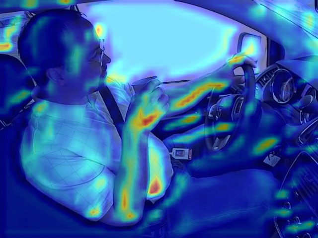

# State-Farm-Distracted-Driver-Detection

<i> Kaggle hosted the challenge few years ago which focused on identifying distracted drivers using Computer Vision  
    Details of challenge can be found here - https://www.kaggle.com/c/state-farm-distracted-driver-detection </i>

    

    
  <h3> Problem Description </h3>
  Given a image for a driver we need to identify how the driver is distracted and under wich conditions.The major reasons for distraction   are - talking to fellow passengers, texting/calling, eating/drinking, etc.
    
  <h3>Dataset details -</h3> 
  <ul>
  <li> Image Size - 640*440</li>
  <li> Training Images count - 22000 </li>
  <li> Test Images count - 70000 </li>
  <li> Image type - RGB </li>
  <li> Image field of view - Driver and passenger </li>
  <li> The 10 classes to predict are:  
        <ul>
          <li>    c0: safe driving 
          <li>    c1: texting - right 
          <li>    c2: talking on the phone - right 
          <li>    c3: texting - left 
          <li>    c4: talking on the phone - left 
          <li>    c5: operating the radio 
          <li>    c6: drinking 
          <li>    c7: reaching behind 
          <li>    c8: hair and makeup 
          <li>    c9: talking to passenger</ul>
   <li> Loss - multi-class logarithmic loss</li>
  </ul>
  
  <h3> Impementation Details</h3>
  <ul>
  <li> DL Model - CNN's build from scratch ( 6 Conv Layer, 5 Dropout Layer, 3 Dense Layer)
  <li> Framework - Keras / Pytorch version in the process.
  <li> CNN Model Visualization - GradCAM
  <li> Final Accuracy -Train acc - 99.06%, Val acc-99 .46%
  </ul>
  
<h4> GRAD-CAM implementation for a test image with label drinking </h4>

